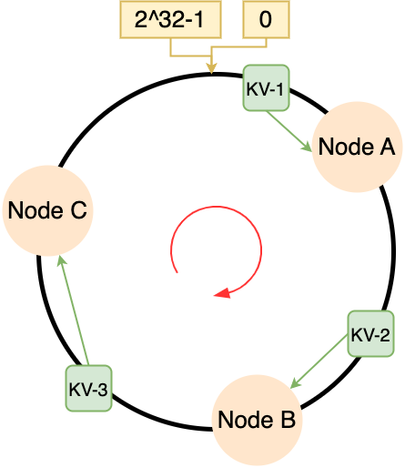
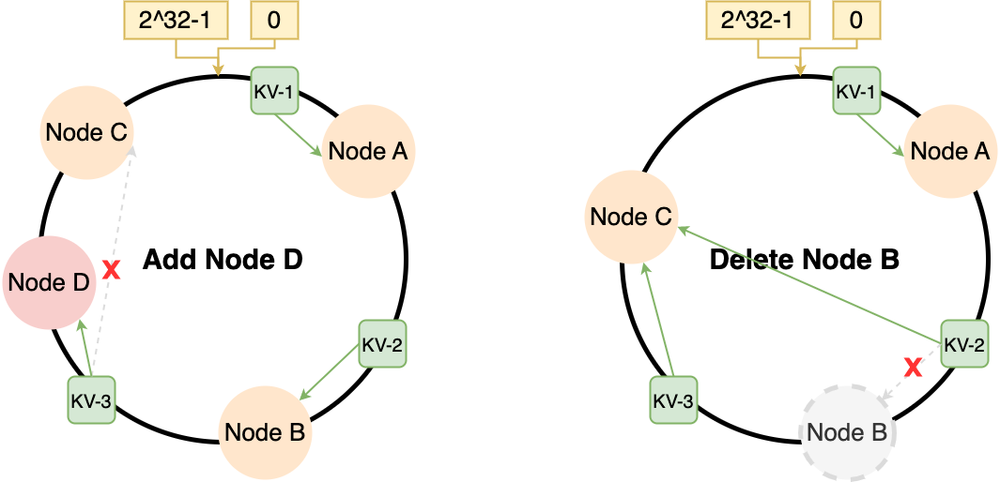
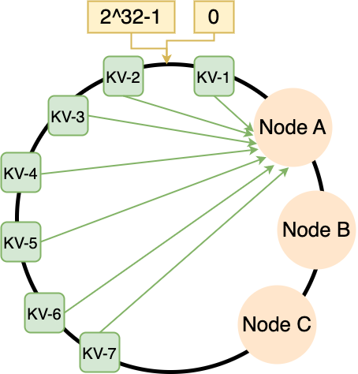
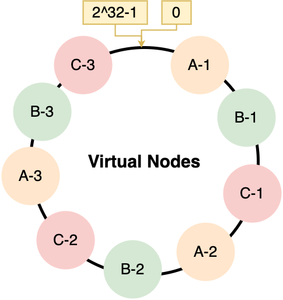
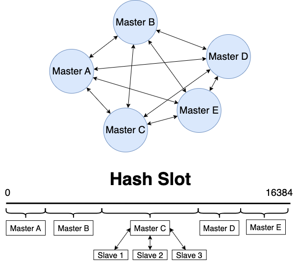
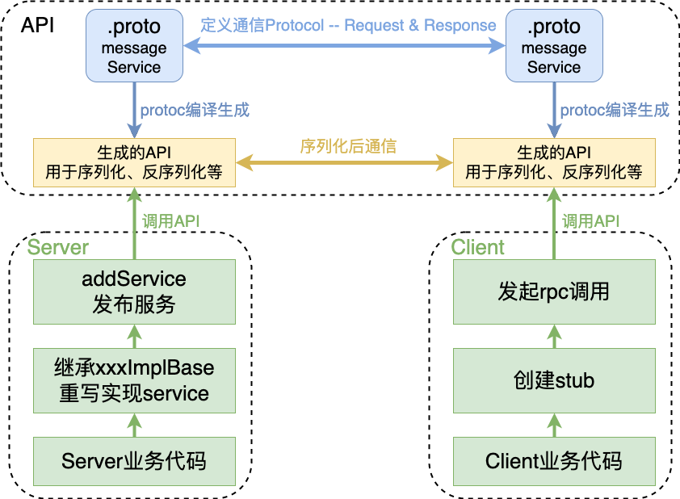
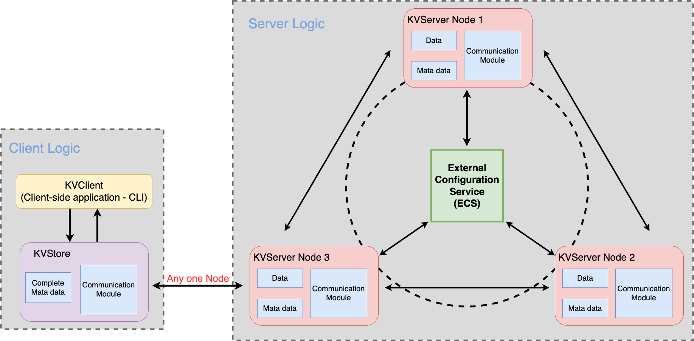
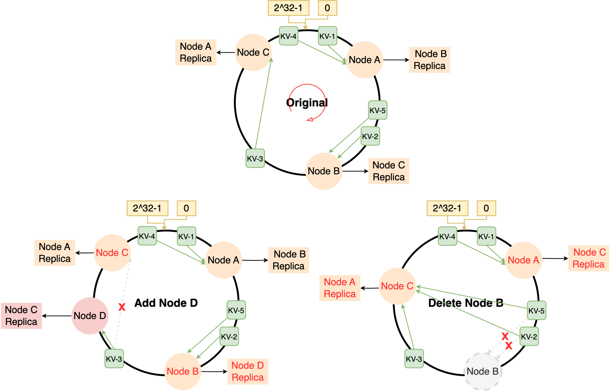

[Chinese REAMDE](docs/README_zh.md)

# Background

## *Distributed System*

Large-scale web-based applications, such as social networks, online marketplaces, and collaboration platforms, need to serve millions of online users simultaneously, handle large amounts of data, and be available around the clock. While today's database management systems are powerful and flexible, they were not specifically designed for this type of usage. **Key-value stores (KV-stores)** attempt to fill this gap by providing a simpler data model that is often sufficient to support the storage and querying requirements of web-based applications.

Key-value stores typically relax the ACID (Atomicity, Consistency, Isolation, Durability) transaction model of traditional database management systems and provide a BASE model (Basically Available, Soft state, Eventually consistent) that trades off consistency for performance and availability. The BASE model forms the foundation for efficiently and reliably scaling databases. It enables the distribution and replication of data across a set of large servers.

**The goal of this task is to extend the centralized storage server architecture in ms2 into a resilient and scalable distributed storage system**. Data records (i.e., key-value pairs) are distributed across multiple storage servers by leveraging the capability of consistent hashing. Each storage server is responsible for only a subset of the entire data space, which corresponds to a range of continuous hash values. A hash function is used to determine the location of a specific tuple (i.e., the hash value of the associated key).

The client library (KVStore) accesses the storage service by providing a well-defined KV-Storage interface (connect, disconnect, get, put). Additionally, the library abstracts the data distribution from the client application, which interacts only with the entire storage service while the library manages the communication with individual storage servers. To forward requests to the server responsible for a specific tuple, the client library maintains metadata about the current state of the storage service. Due to internal reorganization within the storage service, the client's metadata may become outdated. Hence, the library must handle requests optimistically. If a client request is forwarded to the wrong storage node, the server will return appropriate error messages along with the latest version of the metadata. After updating the metadata, the client eventually retries the request, possibly contacting another storage server.

Each storage server (KVServer) is responsible for a portion of the data based on its position in the hash space (as depicted in the diagram below). The position implicitly defines a subrange of the complete hash range.

The storage servers are monitored and controlled by ECS (Elastic Control Service). Through this configuration service, administrators can initialize and control the storage system (e.g., add/remove storage servers and invoke metadata coordination on the affected storage servers). In ms3, this is a single point of failure.

## *Consistent Hashing*

### Problems of IP hash

IP hashing is a straightforward approach, where the **number of nodes N is used in a modulo operation**. However, the core problem arises when the number of nodes changes, such as during system scaling up or down. In such cases, **data with altered mapping relationships must be migrated**; otherwise, it can lead to mapping inconsistencies and data query issues.

To address this problem, when scaling up or down the distributed system and performing node migration, it is possible that in the worst-case scenario, all node data needs to be adjusted. In this case, the complexity of node migration can be O(N), which can be a significant cost. **The improvement strategy derived from IP hashing is to minimize the number of node migrations as much as possible when changing the number of nodes.**

### Process of Consistent Hashing



The consistent hashing algorithm also involves a modulo operation, but it is performed on a **fixed value** of $2^{32}$. The hash ring is a circular structure consisting of $2^{32}$ integers. Consistent hashing uses the MD5 algorithm as its hashing function. Although **MD5** is currently vulnerable to collision attacks, it is efficient enough for the number of nodes in a distributed system.

Consistent hashing **maps both storage nodes and data to a unified hash ring**, which is achieved through two-level hashing: one for the nodes and another for the key-value (KV) data.

1. **The hash calculation is performed on the storage nodes**, mapping them to the hash ring. For example, the hashing can be done based on the IP address of the nodes: `hash(<ip>+<port>)`.
2. When storing or accessing data, **the key is hashed**: `hash(key)`.

After the two-level hashing process, how are the KV data assigned to specific nodes? The data is allocated to the first node found in the clockwise direction.

For example, in the following example, KV-1's key is mapped to Node A, which is the first node found in the clockwise direction. KV-2 and KV-3 are mapped to Node B and Node C, respectively.

### Effectiveness against enlarging & shrinking nodes



* Scaling up: Assuming a new node D is added, and at that moment, the next node in the clockwise direction from KV-3 is node D. In this case, only one data migration is required to move KV-3 from its current node to node D.
* Scaling down: Assuming a node B is removed. At this point, KV-2 needs to be migrated from node B (which acts as a backup) to node C. Again, only one data migration is needed to accomplish this.

### Data skew



If, by chance, the majority of the data is concentrated on one side of a node, then all the data pressure is focused on that particular node, which undermines the efforts of consistent hashing to achieve distributed load balancing. What's even more alarming is that when that node cannot handle the load and goes offline, it not only requires extensive data migration but may even trigger a cascading node failure. This means that Node B and Node C may also become overwhelmed, leading to a complete system crash.

### Rebalance via virtual nodes

To solve the problem of uneven data allocation on the hash ring, a large number of nodes is required. The more nodes there are, the more evenly the data will be distributed on the hash ring.

However, in practice, it may not be feasible to have a large number of nodes. In such cases, **virtual nodes** can be introduced. **This involves creating multiple replicas or copies of a single physical node**. Instead of directly mapping the physical nodes to the hash ring, the virtual nodes are mapped onto the hash ring. Each virtual node is then mapped to a corresponding physical node. This introduces two levels of mapping relationships: virtual nodes to the hash ring and virtual nodes to physical nodes.



In practical engineering, the number of virtual nodes is often significantly larger. For example, in Nginx's consistent hashing algorithm, each real node with a weight of 1 is associated with 160 virtual nodes. With the introduction of virtual nodes, it is also possible to assign higher weights to better-performing hardware configurations. This can be achieved by adding more virtual nodes to nodes with higher weights. **The consistent hashing method with virtual nodes is not only suitable for scenarios with nodes having different hardware configurations but also for scenarios where the node scale may change.**

### Java Hash API

Documentation for `java.security.MessageDigest` <https://docs.oracle.com/javase/8/docs/api/java/security/MessageDigest.html>

* Construct `MessageDigest(String algorithm)`: Creates a message digest with the specified algorithm name, supporting MD5, SHA-1, and SHA-256.
* `getInstance(String algorithm)`: Returns a MessageDigest object that implements the specified digest algorithm.
* `update()` method: Begins the computation of the hash value.
* `digest()` method: Retrieves the encrypted content. After calling the `digest()` method, the state of the MessageDigest object is reset to the initial state.
* `reset()` method: Resets the state of the MessageDigest object to the initial state.

## *Redis Cluster*

### Work mode of cluster

* To ensure high availability, the Cluster mode also introduces a master-slave replication mode, where each master node corresponds to one or more slave nodes. When a master node fails, the slave node(s) will be activated.
* The minimum configuration for a Cluster mode cluster is six nodes (3 masters and 3 slaves) because it requires a majority for operations. **The master nodes handle read and write operations, while the slave nodes serve as backup nodes and do not accept client requests except for failover purposes.**
* All Redis nodes are interconnected using the PING-PONG mechanism, and binary protocols are used internally to optimize transmission speed and bandwidth.
* A master node is considered faulty only when more than half of the nodes in the cluster detect its failure.
* Clients connect directly to Redis nodes without the need for an intermediate proxy layer. Clients do not need to connect to all nodes in the cluster; connecting to any available node in the cluster is sufficient.

### Hash Slot




Redis Cluster is a leaderless distributed storage solution that uses hash slots for sharding instead of consistent hashing.

**Each server node can have multiple hash slots within a certain range.** When using the hash slot algorithm for data sharding, the specific calculation is as follows:

* Hash function: Redis uses the **CRC16** algorithm as the hash function to calculate the hash value of the data key.
* Number of slots: The entire Redis cluster uses **a fixed number of 16384 slots**, which means there can be a maximum of 16384 nodes. Each slot can hold multiple key-value pairs. Each slot is assigned a unique number ranging from 0 to 16383.
* Slot allocation: Based on the hash value of the key, the key is assigned to the corresponding slot using the modulo operation. The steps are as follows:
  * Calculate the hash value of the key and obtain a hash result. Then perform a modulo operation with the number of slots, 16384, to get the remainder (a value between 0 and 16383). `CRC16(key) mod 16384`
  * Store the key in the corresponding slot, where the slot number is the calculated remainder. Store it in `slot[ CRC16(key) mod 16384 ]`.

For example, let's consider a Redis cluster with three nodes (Node1, Node2, Node3), where each node is responsible for a range of slots:

* Node1: Slots with numbers `[0, 5460]`
* Node2: Slots with numbers `[5461, 10922]`
* Node3: Slots with numbers `[10923, 16383]`

When storing a key-value pair, the key is first hashed using CRC16, resulting in a 16-bit hash value.

* The hash value is then subjected to the modulo operation. Let's say the result is 12345.
* The key is stored in the slot with the number 12345.

### How to allocate Hash Slot

**Automatic Slot Allocation:** When creating a Redis cluster using the `cluster create` command, Redis automatically distributes all hash slots evenly across the cluster nodes. For example, if there are 9 nodes in the cluster, each node will have 16384/9 slots.

**Manual Slot Allocation:** It is possible to manually establish connections between nodes using the `cluster meet` command and form a cluster. Then, the `cluster addslots` command can be used to specify the number of hash slots on each node.

Note: If manually assigning hash slots, all 16384 slots must be allocated, otherwise the Redis cluster will not work correctly.

### Hash Slot vs. Consistent Hashing

Consistent hashing is a technique that uses virtual nodes to handle data migration and ensure data safety and cluster availability in the event of node failure. Redis Cluster, on the other hand, employs a master-slave mechanism to maintain data integrity, where master nodes handle data writes and slave nodes synchronize data. When a master node fails, a new master node is elected through an election mechanism from the available slave nodes, ensuring high availability.

However, there is a consideration in this setup. If a master node experiences a high load on a particular key due to a sudden surge in access, it may become overloaded and fail. Subsequently, when a new node is elected as the master from the available slave nodes, it may also fail due to the same load. This process can cascade, leading to a cache avalanche scenario.

## *protobuf & gRPC*

### protobuf

The main APIs used are map-type APIs and message-related APIs, especially the Builder.

```protobuf
map<int32, int32> weight = 1;
```

The protoc compiler will generate the following methods in the message class and its builder:

* `Map<Integer, Integer> getWeightMap();`: Returns an **immutable** map.
* `int getWeightOrDefault(int key, int defaultValue);`: Returns the value associated with the key, or the default value if the key does not exist.
* `int getWeightOrThrow(int key);`: Returns the value associated with the key, or throws an IllegalArgumentException if the key does not exist.
* `boolean containsWeight(int key);`: Checks if the map contains the key.
* `int getWeightCount();`: Returns the number of elements in the map.

The protoc compiler will only generate the following methods in the message's builder:

* `Builder putWeight(int key, int value);`: Inserts a key-value pair.
* `Builder putAllWeight(Map<Integer, Integer> values);`: Adds all entries in the given map to this field.
* `Builder removeWeight(int key);`: Removes the key-value pair from this field.
* `Builder clearWeight();`: Removes all entries from this field.
* `@Deprecated Map<Integer, Integer> getMutableWeight();`: Returns a **mutable** map. Note that multiple calls to this method may return different map instances. The returned map reference may be invalidated by any subsequent method calls to the Builder.

### gRPC



4 Ways of communication

1. Simple RPC / Unary RPC: One request corresponds to one response.
2. Server Streaming RPC: One request corresponds to multiple responses.
3. Client Streaming RPC: Multiple requests correspond to one response. (e.g., IoT)
4. Bi-directional Streaming RPC: Multiple requests correspond to multiple responses.

# Components



## *ECS*

### Bootstrap server

A bootstrap server in a distributed system refers to a special node or service that is used to bootstrap (initialize) newly joining nodes. It plays a crucial role during system startup or when new nodes join the system

In a distributed system, when a new node joins, it needs to be aware of the existence and configuration of other nodes in order to communicate and collaborate with them. This process is often referred to as the bootstrap process. The bootstrap server acts as a central node or service that provides node discovery and configuration information to assist new nodes in joining the system

When a new node starts up, it contacts the bootstrap server to obtain a list of known nodes in the system, their network addresses, role information, and other relevant details. With this information, the new node can establish connections with other nodes and participate in the overall operation of the system

The bootstrap server can be a standalone server or a specific node within the distributed system. It typically exhibits stability and high availability to ensure the reliability and scalability of the system. In some systems, specialized services such as ZooKeeper or etcd are used to implement the bootstrap server, providing node management and configuration services

In summary, a bootstrap server in a distributed system is a special node or service used to bootstrap newly joining nodes. It provides node discovery and configuration information, helping new nodes establish connections and collaborate with other nodes in the system

### Add KVServer

### Remove KVServer

### Functionality

## *KVServer*

The position of a particular storage server is calculated by hashing its address and port (i.e. `<IP>:<Port>`)

### Functionality

## *KVStore*

### Functionality

## *Client*

### Functionality

# Protocol

## *Data transfer*



### Subjectively down

### Objectively down