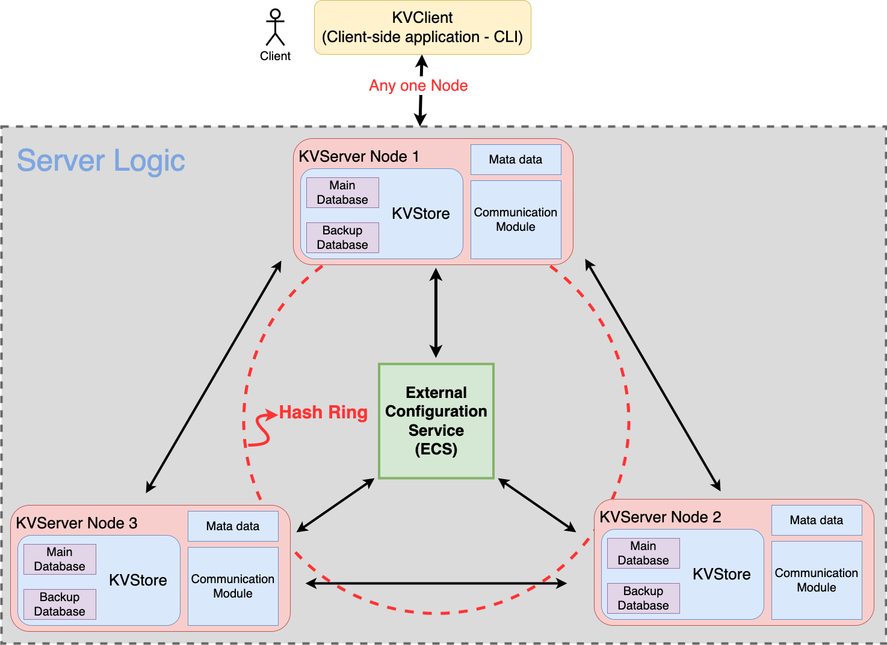
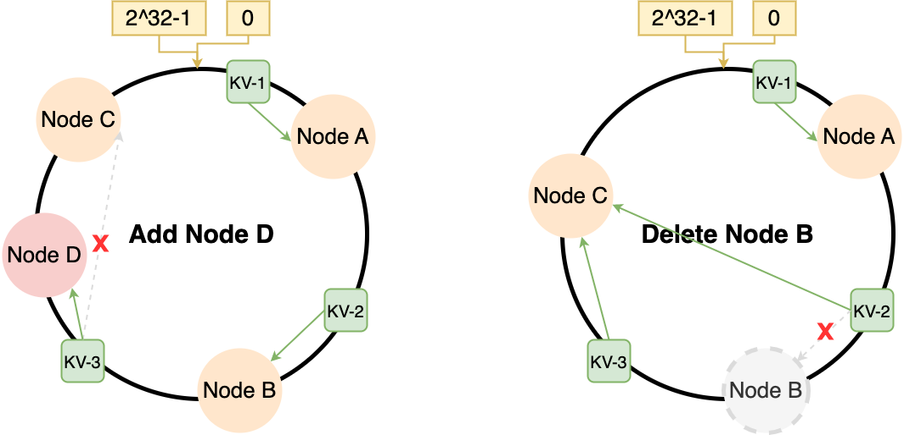

# 分布式数据库实现

## 服务器与客户端

### 服务端上线CLI参数

- -p：设置服务器监听的端口
- -a：设置服务器监听的IP地址
- -b：注册中心ECS的IP:Port
- -d：持久化数据存放的目录
- -l：存放日志的地址
- -ll：日志等级，即INFO、ALL等
- -c：Cache的大小，比如100 keys
- -s：Cache更新策略
- -h：打印帮助信息

### 客户端连接API

- `connect <addrs> <port>` ：连接到某个特定IP:Port的服务器
- `disconnect` ：断开连接
- `put <key> <val>`：放数据
- `get <key>`：取数据
- `send <message>` ：服务器会echo back发送的message
- `logLevel <level>`：调整日志等级
- `help`：查看帮助
- `quit`：退出client

### 命令的处理请求与返回

## 网络IO

在ECS注册中心和KVServer服务器的通信过程中，二者的身份会发生一次交换。

ECS注册中心使用了BIO线程池来对外提供注册服务，它是先于其他所有KVServer启动的，守候在某个特定的IP:Port上监听KVServer的连接到来。当KVServer的连接到来时，ECS会分出一个专门的线程来处理KVServer的下线工作，然后作为一个KVServer的客户端构建一个NIO的SocketChannel连街道KVServer中，从而调用之后的Metadata同步、数据转移等工作。

KVServer中存在两种IO通信，当KVServer上线时，首先构建BIO的socket向ECS注册，此时KVServer是ECS的一个客户端。注册完毕之后，KVServer在作为服务器对外提供服务的时候采用了Java NIO的通信模式。我们将之后来自ECS的其他请求和连接到KVServer的client的请求统一到了NIO的`next.isReadable()` 检测状态中，此时ECS的身份转换为了一个KVServer的客户端。

Java NIO 是Java提供的一种IO模型，引入了一组新的API，用于高效地进行多路复用的I/O操作。相比于传统的Java BIO，Java NIO提供了更为灵活和高性能的I/O操作方式。

Java NIO的核心组件包括以下几个部分：

1. Channel：通道是数据传输的载体，可以通过通道读取和写入数据。在Java NIO中，提供了不同类型的通道，如文件通道、套接字通道等。
2. Buffer：缓冲区是用于存储数据的对象，可以通过缓冲区读写数据。缓冲区提供了对数据的结构化访问方式，可以按照不同的数据类型（如字节、字符等）读写数据。
3. Selector：选择器是用于多路复用非阻塞通道的机制，可以通过一个线程管理多个通道的I/O操作。选择器可以监听多个通道的事件，并在事件发生时进行相应的处理。

## 数据存储

### 数据持久化

数据持久化是将数据存储到非易失性介质（如硬盘、固态硬盘、闪存等）中的过程，以确保在计算机系统关闭或断电后仍能保留数据，并在系统重新启动后能够恢复和使用，而不会丢失数据。

对于本项目而言，考虑到数据规模较小，我们采用了简单的数据持久化方案，即将每个键值对存储到对应的文件中，以实现数据的持久化。

为了提高系统的读写效率，我们采用了双数据库架构：主数据库和备份数据库。备份数据库仅存储在硬盘中，通常不对外提供访问。而主数据库则同时存储在硬盘和缓存区中。当客户端写入数据时，数据首先被写入主数据缓存区，然后以异步方式复制到主数据库和备份数据库的硬盘目录中。在执行读操作时，系统首先查询主数据缓存区，如果数据不在缓存中，则查询硬盘中的数据。

通过以上架构，我们能够实现数据的持久化存储，并提高系统的读写效率。备份数据库的存在可以作为数据的冗余备份，以提供更高的数据可靠性。同时，主数据库的缓存机制可以加速数据的读取，提升系统的响应速度。

### 缓存更新策略

对于缓存中的键值对替换策略，可以实现以下三种策略：

1. 先进先出（FIFO）：
根据键值对进入缓存的顺序，最早进入缓存的键值对将被替换出去。
2. 最近最少使用（LRU）：
根据键值对的访问时间，最近最少被使用的键值对将被替换出去。我们使用Java 的LinkedHashMap实现LRU策略，将最近访问的键值对放在链表头部，当缓存已满时，替换链表尾部的键值对。
3. 最不经常使用（LFU）：
根据键值对的访问频率，最不经常被使用的键值对将被替换出去。我们使用哈希表结合优先队列实现LFU策略，将键值对和对应的访问频率进行跟踪和管理，当缓存已满时，替换访问频率最低的键值对。

当客户端的GET请求导致缓存未命中时，将在磁盘上查找相应的键值对并将其转移到缓存中。如果缓存已满，根据当前选择的策略，将选择一对特定的键值对进行替换，并将其置换到磁盘上（可能会在磁盘上进行更新）。同样地，当接收到客户端的PUT请求且缓存已满时，将根据当前选择的策略，选择一对特定的键值对进行替换。

## 分布式集群

### Overview

### Components

- **注册中心：集群管理**
- **KVServer 服务器节点**
    - **KVStore 数据库**

### **Bootstrap server 注册中心**

在分布式系统中，引导服务器（bootstrap server）是指用于引导（初始化）新加入节点的特殊节点或服务。它在系统启动或新节点加入系统时起着关键作用。

在分布式系统中，当新节点加入时，它需要知道其他节点的存在和配置，以便进行通信和协作。这个过程通常称为引导过程。引导服务器充当一个中心节点或服务，提供节点发现和配置信息，帮助新节点加入系统。

当新节点启动时，它会联系引导服务器，获取系统中已知节点的列表、网络地址、角色信息和其他相关细节。有了这些信息，新节点可以与其他节点建立连接，参与系统的整体运行。

引导服务器可以是一个独立的服务器或分布式系统内的特定节点。它通常展现出稳定性和高可用性，以确保系统的可靠性和可扩展性。在某些系统中，会使用专门的服务，如ZooKeeper或etcd来实现引导服务器，提供节点管理和配置服务。

总之，在分布式系统中，引导服务器是用于引导新加入节点的特殊节点或服务。它提供节点发现和配置信息，帮助新节点与系统中的其他节点建立连接并进行协作。

### **功能**

- 维护数据
- 添加/移除 KVServer 节点
  
    当有节点需要下线的时候，该节点会发送删除节点请求给注册中心，注册中心接收到请求后，会将该节点加入待删除队列，并逐一处理。
    
- 转移数据
- 更新元数据
- 监控KVServer的状态

---

### 集群通讯

> 集群通讯是指在一个分布式系统中，多个节点之间通过网络进行相互通信和协作的过程。在集群通讯中，节点可以是物理服务器、虚拟机、容器等，它们通过网络连接在一起，以实现数据的传输、任务的分配、协调和同步等操作。
> 

在我们的实现中，我们采用了自定义的字符串消息进行集群通讯。每条消息都以字符串的形式进行编码和解码，并通过网络传输到其他节点。我们使用了工厂模式生成消息实例（`-MessageBuilder`），根据消息类型和相关数据创建对应的消息对象。这样可以动态地生成不同类型的消息，以满足集群通讯的需求。

为了处理接收到的消息，我们使用了统一的消息解析器（`-MessageParser`）。消息解析器负责解析接收到的字符串消息，并根据消息的格式和规则执行相应的操作。这样可以保持消息处理的一致性，并提高代码的可读性和维护性。

具体的通讯协议请参考API文档。

### 负载均衡

> 负载均衡是一种技术，它通过将工作负载（例如网络流量、请求或计算任务）分配到多个计算资源上，以提高系统的性能、可靠性和可扩展性。负载均衡确保每个计算资源都得到适当的利用，避免资源过载，同时提高系统的容错能力。
> 

一致性哈希算法被应用于我们的分布式系统，以解决负载均衡和节点扩展的需求。我们计划在未来引入虚拟节点功能。

一致性哈希是解决负载均衡问题的一种算法。传统的哈希算法将资源和请求映射到一个固定的哈希表上，但在分布式环境中，当节点数量变化时，会导致大量的映射变动，这对系统的稳定性和性能造成负面影响。

一致性哈希算法通过将资源和请求映射到一个哈希环上，以环形结构表示。每个资源节点在环上有一个对应的位置，请求通过哈希函数计算得到在环上的位置。当有一个新的请求到达时，一致性哈希算法将其映射到离其位置最近的资源节点上。

一致性哈希解决了传统哈希算法在节点变动时需要重新映射大部分请求的问题。当系统中新增或移除一个节点时，只有该节点附近的请求会受到影响，其他节点和请求的映射关系保持不变。通过调整环上的节点位置，使得新增或移除节点的影响范围最小化。

如下图所示，一致性哈希可以有效应对节点的扩容或缩容

为了进一步提升系统的扩展性和容错性，我们计划在未来扩展我们的分布式系统以支持虚拟节点。虚拟节点将映射到物理节点上，通过更细粒度的控制数据和请求的分布，进一步提升负载均衡的效果。

### 故障容错

> 故障容错是一种在分布式系统中应对节点故障或错误的能力，以确保系统的可用性和可靠性。它旨在通过备份机制和故障检测与恢复策略，使系统能够在节点发生故障时继续正常运行，并尽可能减少用户的影响。
> 

**选择备份节点：**在我们的实现中，我们选择了一种简单而有效的备份策略，即将当前节点在哈希环中的上一个节点作为备份节点。这意味着每个节点都有一个备份节点，用于存储相同的数据副本。

**备份节点数据同步：**当写请求发生时，我们采用异步的方式将数据更新传播到备份节点。具体而言，当写请求到达当前节点时，我们首先将数据写入当前节点的存储，然后异步地将相同的写操作传递到备份节点，以保持数据的最终一致性。(见AP最终一致性)

**故障检测与恢复：**在我们的实现中，我们基于轮询来检测节点是否断开链接。我们通过定期轮询每个线程的连接状态，以快速发现节点故障。一旦故障被检测到，中心节点会将异常节点加入到待删除节点列表中，并逐一处理列表中的节点：从哈希环中删除此节点，更新所有节点的哈希环。同时，由于我们采用了基于哈希环的备份节点策略，对应的备份节点会自动成为负责数据的节点，接管失效节点的工作。这意味着在故障发生后，系统可以无缝地继续运行。

我们还计划实施其他的故障检测与恢复策略，如心跳机制、故障恢复协议等，以进一步提高系统的可靠性和容错性。

### 一致性保证

> 在分布式系统中，数据通常会被复制到多个节点上以提高系统的可用性和容错性。当对数据进行更新操作时，由于网络延迟、节点故障或并发操作等原因，数据的复制可能不是瞬时完成的。因此，在数据复制的过程中，系统中的不同节点上可能存在不同的数据副本。最终一致性模型认为，在没有新的更新操作发生时，经过一段时间的同步和数据交换，系统最终会达到一致的状态。这意味着，如果没有新的写操作发生，系统中的各个节点最终会收敛到相同的数据副本。
> 

在该系统中，使用CompletableFuture进行异步复制，具有低延迟和高性能的特点。然而这相应的会带来一些问题。

我们的集群无法保证完全的**强一致性**。虽然在大部分情况下都能保证强一致性，但在一种极端情况下，集群可能会丢失系统向客户端确认的写入。

集群丢失写入的一个主要原因是它使用了异步IO来处理master和replicas之间的数据传播以及master的刷盘。这意味着在写入期间会发生以下情况：

- Client写数据给master
- Master向Client回复OK
- Master将写入的数据传播到其副本replica

Master在回复client之前不会等待replica的确认，因为这会造成很大的延迟。但这也造成了一种可能（虽然概率极小）的数据丢失的情景：若客户端写入了一些数据，master会确认写入，但在将新写入数据传播给其任意一个replica且本地也没有成功刷盘之前master就崩溃了。从而永远丢失了写入。

可以通过强制数据库在回复客户端之前将数据刷新到磁盘来提高一致性，但这通常会导致性能过低。因此这是在性能和一致性之间进行的权衡。

## Future Plan

ECS 的单点故障需要通过Raft或Paxos等共识算法来解决，也就是将ECS的功能直接分摊给服务器本身。直接实现Raft等算法比较复杂，所以暂时抽象出一个ECS注册中心来管理。

目前已有的数据持久化方式只适用于小规模数据，对于大规模的数据，考虑参照关系性数据库的存储方式，建立表格存储数据。
