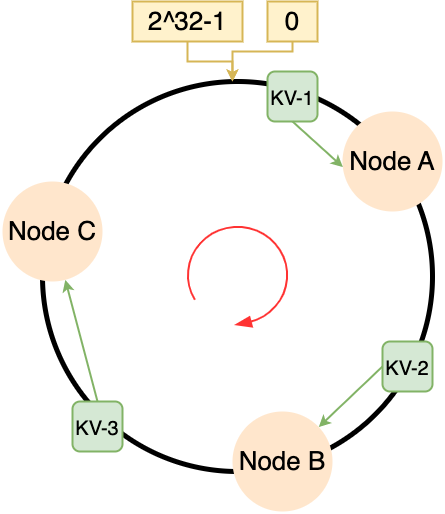

[英文版README](../README.md)

# Background

## *分布式系统*

大规模的基于Web的应用程序，如社交网络、在线市场和协作平台，需要同时为数百万在线用户提供服务，处理大量数据，并且在全天候可用。当今的数据库管理系统虽然功能强大且灵活，但其设计初衷并不是专门为这种使用情况而设计的。**键值对存储 KV-store** 尝试通过提供更简单的数据模型来填补这一空白，这往往足以支持基于Web的应用程序的存储和查询需求

键值存储通常会放宽传统数据库管理系统的ACID（原子性、一致性、隔离性和持久性）事务模型，并提供一个BASE模型（基本可用、软状态和最终一致性），以在性能和可用性上进行权衡，而不是严格保证一致性。BASE模型是以高效可靠地扩展数据库的基础。它实现了数据在一组大型服务器上的大规模分发和复制

**本任务的目标是将ms2中的集中式存储服务器架构扩展为一个弹性、可扩展的分布式存储器**。数据记录（即键值对）通过利用一致性哈希的能力分布在多个存储服务器上。每个存储服务器仅负责整个数据空间的子集（即一系列连续的哈希值范围）。哈希函数用于确定特定元组（即关联键的哈希值）的位置

客户端库（KVStore）通过提供早期定义的KV-Storage接口（connect, disconnect, get, put）来访问存储服务。此外，该库使客户端应用程序对数据的分布对客户端应用程序透明。客户端应用程序仅与整个存储服务进行交互，而库则管理与单个存储服务器的通信。为了将请求转发到负责特定元组的服务器，客户端库维护有关存储服务当前状态的元数据。由于存储服务内部的重新组织，客户端的元数据可能过时。因此，该库必须进行乐观处理请求。如果客户端请求被转发到错误的存储节点，服务器将返回适当的错误信息和最新版本的元数据。更新元数据后，客户端最终会重试该请求（可能联系另一个存储服务器）

每个存储服务器（KVServer）根据其在哈希空间中的位置负责一部分数据（如下图所示的环）。位置隐式地定义了完整哈希范围的子范围

存储服务器由 ECS 进行监控和控制。通过此配置服务，管理员能够初始化和控制存储系统（例如添加/删除存储服务器并调用受影响存储服务器上的元数据协调）。在ms3中，这是一个单点故障

## *Consistent Hashing*

### 用IP哈希算法的问题

IP哈希是很容易想到的，就是**对节点的个数N进行取模运算**。但是核心问题是：**若节点数量发生变化，即对系统做扩容或缩容时，必须迁移改变了映射关系的数据**，否则会出现映射关系紊乱从而查询不到数据的问题

为了解决这个问题，当对分布式系统进行节点的扩容或缩容时，比如要进行数据迁移，最坏的情况下所有节点的数据都要变动。则节点迁移次数的复杂度为***O(N)***，这个代价是很大的。**从IP哈希得到的改进思路是要尽量减少改变节点数量时的迁移次数**

### 一致性哈希过程

一致性哈希算法也是进行取模运算，**但它是对一个固定值 $2^{32}$ 进行取模运算**。哈希环就是一个由 $2^{32}$ 个整数组成的圆形。一致性哈希采用**MD5**作为其哈希算法。虽然MD5目前已经无法防止碰撞攻击，但对于分布式系统的节点数量，出于效率的考量，MD5足够了

一致性哈希是**将存储节点和数据都映射到一个首尾相连的哈希环上**，这是通过两步哈希，即分别对Node和KV对数据做哈希运算实现的

1. **对存储节点进行哈希计算**，即对存储节点做哈希映射，比如根据节点的 IP 地址进行哈希：`hash(<ip>+<port>)`
2. 当对数据进行存储或访问时，**对数据key进行哈希映射**：`hash(key)`

两步哈希完成后，KV对数据要怎么分配给哪一个node呢？**将KV对数据分配给顺时针方向找到的第一个node**

比如说下面的例子中，KV-1的Key对应的Hash值按顺时针第一个找到的第一个Node是Node A，KV-2和KV-3对应的分别是Node B和 Node C



### 有效应对扩容和缩容


* 扩容：假设新增了节点D，且此时KV-3的下一个顺时针节点是节点D，那么只需要进行一次数据迁移
* 缩容：假设减少了节点B，那么此时KV-2要从节点B（备份）迁移到节点C上，只需要进行一次数据迁移

### 数据倾斜 Data skew


若很巧合的大部分数据都集中在一个节点的一侧，那么此时所有数据的压力都集中到了该节点上，也就破坏了一致性哈希的分散负载的努力了。而且更可怕的是当该节点扛不住下线的时候，首先要经历很多的数据迁移，其次甚至可能会引起雪崩式的节点崩溃，也就是Node B，Node C相继扛不住，那这时候整个系统崩溃了

### 通过虚拟节点提高均衡度

要想解决数据在哈希环上分配不均匀的问题，就要有大量的node，值要node越多，哈希环上的数据分布的就越均匀

实际中可能不会有那么多的node，因此可以引入**虚拟节点**，即**对一个真实节点做多个副本 replication**。具体做法是不再将真实节点映射到哈希环上，而是将虚拟节点映射到哈希环上，然后再将虚拟节点映射到实际节点，因此这里有两层映射关系


在实际的工程中，虚拟节点的数量会大很多，比如 Nginx 的一致性哈希算法，每个权重为 1 的真实节点就含有160 个虚拟节点。有了虚拟节点后，还可以为硬件配置更好的节点增加权重，比如对权重更高的节点增加更多的虚拟机节点即可。**带虚拟节点的一致性哈希方法不仅适合硬件配置不同的节点的场景，而且适合节点规模会发生变化的场景**

### Java Hash API

Documentation for `java.security.MessageDigest` <https://docs.oracle.com/javase/8/docs/api/java/security/MessageDigest.html>

* 构造 `MessageDigest(String algorithm)`：创建具有指定算法名称的信息摘要，支持 MD5、SHA-1、SHA-256
* `getInstance(String algorithm)`：返回实现指定摘要算法的 MessageDigest 对象
*  `update()` 方法开始计算哈希值
*  `digest()` 方法获取加密内容，调用 `digest()` 方法后，会将MessgeDigest对象的状态重置为初始化状态
* `reset()方` 法来重置MessgeDigest对象的状态为初始化状态

## *Redis集群*

### cluster的工作模式

* 为了保证高可用，Cluster模式也引入了主从复制模式，一个主节点对应一个或者多个从节点，当主节点宕机的时候，就会启用从节点
* Cluster模式集群节点最小配置6个节点（3主3从，因为需要半数以上），其中**主节点提供读写操作，从节点作为备用节点，不提供请求，只作为故障转移使用**
* 所有的redis节点彼此互联（PING-PONG机制），内部使用二进制协议优化传输速度和带宽
* 主节点fault 是通过集群中超过半数的节点检测失效时才生效
* client与redis node直连，不需要中间代理层。客户端不需要连接集群所有节点，连接集群中任何一个可用节点即可

### 哈希槽 Hash slot


Redis Cluster 是一种无主模式 Leaderless 的无主分布式存储方案，它没有采用一致性哈希，而是采用哈希槽进行分片

**每一个Server node可以有一定范围内的多个哈希槽**。当使用Hash插槽算法进行数据分片时，具体的计算方式如下：

* 哈希函数：Redis使用**CRC16算法**作为哈希函数，对数据 Key 做哈希计算

* 插槽数量：整个Redis集群**固定使用16384个插槽**，也就是说最多可以有16384个node。每个插槽可以容纳多个KV pair。每个插槽都有一个唯一的编号，从0到16383

* 插槽分配：根据键的哈希值，通过取模运算将键分配到相应的插槽中。具体步骤如下

  * 对键进行哈希计算，得到一个哈希值。并将哈希值对插槽数量16384进行取模运算，得到余数（0到16383之间的数值）。`CRC16(key) mod 16384`

  * 将Key存储到对应的插槽中，该插槽的编号就是上面计算的余数。存入 `slot[ CRC16(key) mod 16384 ]` 中

举个例子：假设有一个Redis集群，包含三个节点（Node1、Node2、Node3），每个节点负责一部分插槽

* Node1：插槽编号为 `[0, 5460]` 的插槽
* Node2：插槽编号为 `[5461, 10922]` 的插槽
* Node3：插槽编号为 `[10923, 16383]` 的插槽

当需要存储一个KV时，先对key进行CRC16哈希计算，得到一个16位的哈希值

* 对哈希值进行取模运算，假设结果为12345
* 将key存储到插槽编号为12345的插槽中

### 哈希槽的分配方案

* **平均分配：** 使用 `cluster create` 创建 Redis 集群时，Redis 会自动把所有哈希槽平均分布到集群节点上。比如集群中有 9 个节点，则每个节点上槽的个数为 16384/9 个

* **手动分配：** 可以使用 `cluster meet` 命令手动建立节点间的连接，组成集群，再使用 `cluster addslots` 命令，指定每个节点上的哈希槽个数

  注意：若手动分配哈希槽，必须把 16384 个槽都分配完，否则 Redis 集群无法正常工作

### 哈希槽 vs. 一致性哈希

一致性哈希是创建虚拟节点来实现节点宕机后的数据转移并保证数据的安全性和集群的可用性的。redis cluster是采用master节点有多个slave节点机制来保证数据的完整性的,master节点写入数据，slave节点同步数据。当master节点挂机后，slave节点会通过选举机制选举出一个节点变成master节点，实现高可用。**但是这里有一点需要考虑，如果master节点存在热点缓存，某一个时刻某个key的访问急剧增高，这时该mater节点可能操劳过度而死，随后从节点选举为主节点后，同样宕机，一次类推，造成缓存雪崩**

## *protobuf & gRPC*

### protobuf

### gRPC

# 结构


## *ECS*

### Bootstrap server

在分布式系统中，引导服务器（bootstrap server）是指用于引导（初始化）新加入节点的特殊节点或服务。它在系统启动或新节点加入系统时起着关键作用

在分布式系统中，当新节点加入时，它需要知道其他节点的存在和配置，以便进行通信和协作。这个过程通常称为引导过程。引导服务器充当一个中心节点或服务，提供节点发现和配置信息，帮助新节点加入系统

当新节点启动时，它会联系引导服务器，获取系统中已知节点的列表、网络地址、角色信息和其他相关细节。有了这些信息，新节点可以与其他节点建立连接，参与系统的整体运行

引导服务器可以是一个独立的服务器或分布式系统内的特定节点。它通常展现出稳定性和高可用性，以确保系统的可靠性和可扩展性。在某些系统中，会使用专门的服务，如ZooKeeper或etcd来实现引导服务器，提供节点管理和配置服务

总之，在分布式系统中，引导服务器是用于引导新加入节点的特殊节点或服务。它提供节点发现和配置信息，帮助新节点与系统中的其他节点建立连接并进行协作

### 功能

* 维护数据
* 添加/移除 KVServer 节点
* 转移数据
* 更新元数据
* 监控KVServer的状态

### 添加 KVServer 节点

当一个新的 KVServer 连接到 ECS 时，ECS 的操作如下：

* 通过对用于与客户端通信的服务器端口地址进行哈希运算，确定新存储服务器在哈希环中的位置

* 重新计算并更新存储服务的元数据（即新存储服务器及其后继节点的范围）

* 使用更新后的元数据初始化新的存储服务器

* 在后继节点上设置写锁

* 调用将受影响的数据项（即之前由后继节点处理的键范围）转移给新存储服务器。转移的数据不应立即删除，以便同时能够处理读请求

* 当所有受影响的数据已转移（即后继节点向 ECS 发送通知）时

  * 向所有存储服务器发送元数据更新（以通知它们其新的职责）

  * 释放后继节点上的写锁，并最终删除不再由该服务器处理的数据项

### 移除 KVServer 节点

将 KVServer 实例从存储服务中移除的 ECS 的步骤可以总结如下： 

* KVServer 向 ECS 发送关闭消息（确保添加 shutdown hook）
* 重新计算并更新存储服务的元数据（即后继节点的范围）
* 在需要删除的服务器上设置写锁
* 向后继节点发送元数据更新（即后继节点现在还负责要删除的服务器的范围）
* 调用将受影响的数据项（即要删除的服务器的所有数据）转移到后继服务器。转移的数据不应立即删除，以便同时能够处理读请求
* 当所有受影响的数据已转移（即要删除的服务器发送通知给 ECS）时，ECS 向剩余的存储服务器发送元数据更新
* 继续关闭存储服务器的操作

## *KVServer 节点*

### KVServer & ECS的交互

根据存储服务器（KVServer）在环中的位置（i.e. `<IP>:<Port>`），它只需要维护存储服务中存在的整个数据的子集。与ms2中一样，这些数据使用某种可选的缓存置换策略在磁盘上进行持久存储。KVServer与KVClient的KVStore库进行通信并处理它们的请求（类似于ms2）。**为了确定由哪一个KVServer节点**来处理特定的请求（即请求的键是否在该KVServer的范围内），**KVSever必须维护存储服务的元数据**

注意：为了能够在KVClient发出错误的地址请求时通知KVClient，KVServer必须持有**所有节点的完整的元数据**。但是KVServer上的元数据更新只能由ECS调用

### API

除了查询功能（put、get）之外，服务器还必须为ECS提供以下控制功能。由于所有这些操作都必须由ECS**远程调用 remote call**，因此必须定义消息和命令以及参数传递命令

一旦启动了KVServer应用程序，它会处于 **stopped** 状态。这意味着它能够接受客户端连接，但会回复 `SERVER_STOPPED` 给查询。然后KVServer连接到ECS以取得其元数据


KVClient的get put是发给KVStore，然后再由KVStore转发给KVServer

### Metadata

定义一个适当的表示形式（例如一个映射）用于元数据，在整个系统的所有组件（即KVStore、KVServer和ECS）中保持一致。该数据结构将存储节点的地址映射到相应的哈希范围

## *Client*

### KVStore的作用

Client library/KVStore 提供了一个抽象来查询存储服务。KVServer的实际情况对KVClient完全透明，也就是说对于KVClient而言，它就好像是在读写一个ms2中的集中式数据库一样。由于KVStore提供相同的功能，因此可以直接用ms2的KVClient而无需更改。然而，由于完整数据集被切分 sharding，KVStore 必须将每个client请求转发到负责相关key的KVServer，**因此需要维护有关KVServer的元数据以识别相应的KVServer**。一开始KVStore没有可用的元数据，KVClient必须手动连接到KVSever之一（我们假设用户至少需要知道一个KVServers）

建立连接后，所有请求都将转发到该服务器（乐观查询 optimistic querying）。由于数据是分布式的，可能会发生请求发送到错误的存储节点且无法处理的情况。在这种情况下，KVSever将以特定的错误消息回答（见下文）。从而KVStore将更新其元数据（keyrange）、确定正确的存储服务器并连接到它并重试请求。重试操作对客户端应用程序透明

### client获取的状态码

* `not_responsible` 是KVServer响应无法处理的请求的状态，因为KVClient请求的键不在其范围内。**此类消息不应传递回KVClient，而是调用对keyrange的检索**

* `server_stopped` 表示当前KVServer暂时不处理任何请求，因为整个KVServer正处于初始化阶段。因此从客户端的角度来看，KVServer停止了为请求提供服务。KVClient会使用 exponential back-off with jitter 进行多次重试

* `server_write_lock` 表示KVServer当前由于重新分配数据（ECS加入或移除KVServer）而阻塞了写请求

* `keyrange_success` 返回负责该范围的范围和KVServer。范围用十六进制（128位）表示。范围列表和相应的服务器以**分号**分隔的三元组形式返回

  ```
  <kr-from>, <kr-to>, <ip:port>; <kr-from>, <kr-to>, <ip:port>;...
  ```

# Protocol

所有消息都是以\r\n分隔的明文

## *数据转移*


### 主动下线


### 故障下线

